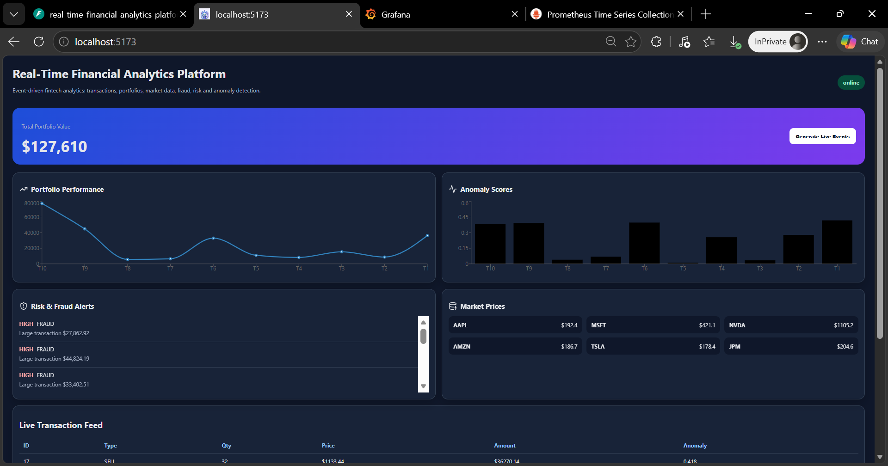
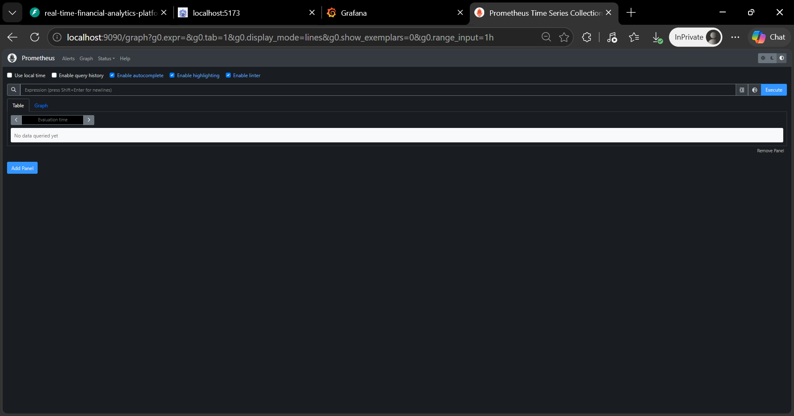
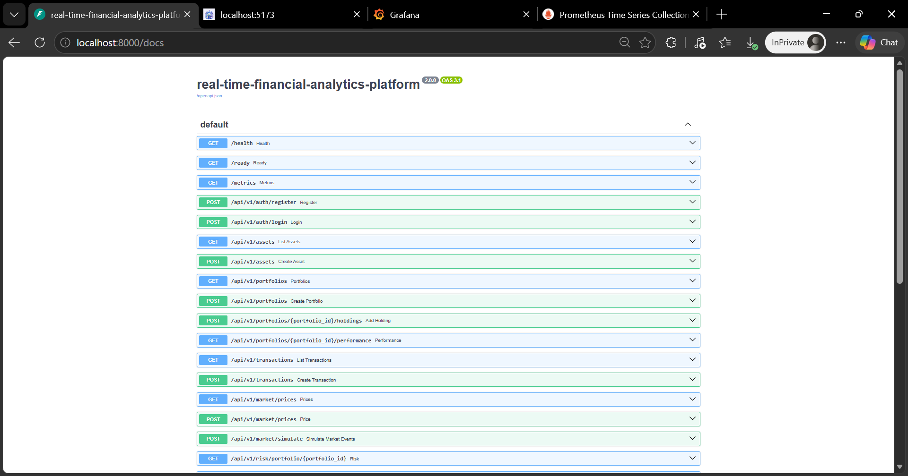
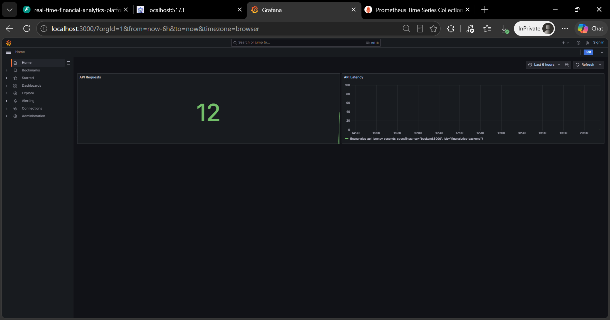
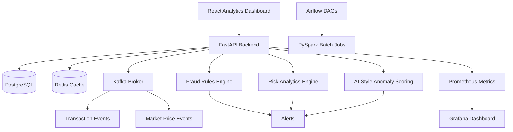
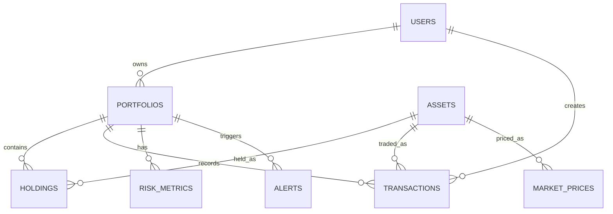
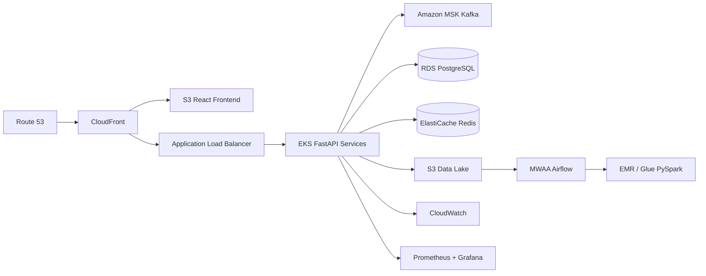

<div align="center">

# 📈 Real-Time Financial Analytics Platform

### Production-grade event-driven fintech analytics platform for transactions, portfolios, market data, fraud, risk, observability, and AI-style anomaly detection.

<p>
  
  
  
</p>

<p>
  
  
  
</p>

<p>
  
  
  
</p>

<p>
  <a href="#-overview">Overview</a> •
  <a href="#-features">Features</a> •
  <a href="#-screenshots">Screenshots</a> •
  <a href="#-architecture">Architecture</a> •
  <a href="#-quick-start">Quick Start</a> •
  <a href="#-api-reference">API</a> •
  <a href="#-troubleshooting">Troubleshooting</a>
</p>

</div>

---

## 📌 Overview

**Real-Time Financial Analytics Platform** is a portfolio-grade fintech simulation system that ingests financial transactions, simulates market prices, calculates portfolio performance, classifies fraud and risk alerts, and exposes operational metrics through Prometheus and Grafana.

The project is designed to demonstrate senior-level engineering across **backend systems, event-driven architecture, data engineering, observability, DevSecOps, cloud-ready deployment, and full-stack product delivery**.

It simulates how a fintech organization could process market and transaction events across a streaming architecture while maintaining operational visibility through dashboards and metrics.

---

## ✨ Features

<table>
<tr>
<td width="33%" valign="top">

### ⚡ Real-Time Platform

- Transaction ingestion APIs
- Market price simulation
- Kafka event publishing
- Portfolio valuation
- Live dashboard refresh
- Event-oriented backend flow

</td>
<td width="33%" valign="top">

### 🛡️ Risk & Fraud

- Fraud rules engine
- Large transaction detection
- AI-style anomaly scoring
- Portfolio concentration risk
- Alert severity classification
- Alert history API

</td>
<td width="33%" valign="top">

### 🚀 Engineering

- FastAPI service layer
- React analytics dashboard
- PostgreSQL persistence
- Redis-ready cache layer
- Prometheus metrics
- Grafana provisioning
- Docker Compose runtime
- Kubernetes manifests
- GitHub Actions + Jenkins

</td>
</tr>
</table>

---

## 🧱 Tech Stack

<div align="center">

<table>
<tr>
<td align="center" width="20%">
<br/>
<b>Python</b><br/>
Backend
</td>
<td align="center" width="20%">
<br/>
<b>FastAPI</b><br/>
API
</td>
<td align="center" width="20%">
<br/>
<b>Kafka</b><br/>
Streaming
</td>
<td align="center" width="20%">
<br/>
<b>PostgreSQL</b><br/>
Database
</td>
<td align="center" width="20%">
<br/>
<b>Redis</b><br/>
Cache
</td>
</tr>
<tr>
<td align="center">
<br/>
<b>React</b><br/>
Frontend
</td>
<td align="center">
<br/>
<b>Docker</b><br/>
Runtime
</td>
<td align="center">
<br/>
<b>Kubernetes</b><br/>
Orchestration
</td>
<td align="center">
<br/>
<b>GitHub Actions</b><br/>
CI/CD
</td>
<td align="center">
<br/>
<b>AWS</b><br/>
Cloud Design
</td>
</tr>
</table>

</div>

---

## 📸 Screenshots

<p align="center">
  
  
</p>

<p align="center">
  
  
</p>

---

## 🏗️ Architecture

<div align="center">



</div>

### 🔄 End-to-End Workflow

```text
User Opens React Dashboard
        ↓
User Clicks Generate Live Events
        ↓
FastAPI Creates Simulated Transactions and Market Events
        ↓
Transaction Data Is Persisted in PostgreSQL
        ↓
Kafka Event Publishing Simulates Streaming Architecture
        ↓
Anomaly Scoring Calculates Transaction Risk Probability
        ↓
Fraud Rules Engine Creates High-Severity Alerts
        ↓
Portfolio Valuation and Performance Metrics Are Refreshed
        ↓
React Dashboard Displays Portfolio, Market, Fraud, Risk, and Transaction Data
        ↓
Prometheus Scrapes API Metrics
        ↓
Grafana Visualizes API Request and Latency Metrics
```

### System Flow

| Step | What Happens                                                           |
| ---- | ---------------------------------------------------------------------- |
| 1    | Dashboard checks backend health and displays online/offline status     |
| 2    | Demo event generation creates realistic transaction and market records |
| 3    | Backend persists transactions, prices, alerts, and portfolio state     |
| 4    | Fraud and anomaly logic classify suspicious transactions               |
| 5    | Dashboard fetches summarized analytics from backend APIs               |
| 6    | Prometheus scrapes `/metrics` from FastAPI                             |
| 7    | Grafana displays platform-level observability metrics                  |

---

## 🗄️ Database Design

<div align="center">



</div>

### Core Entities

| Entity          | Purpose                                            |
| --------------- | -------------------------------------------------- |
| `users`         | Demo users and authentication records              |
| `assets`        | Tradable instruments such as AAPL, MSFT, NVDA, JPM |
| `portfolios`    | User-owned investment portfolios                   |
| `holdings`      | Asset quantities and average cost basis            |
| `transactions`  | Buy/sell activity with anomaly scores              |
| `market_prices` | Simulated market price snapshots                   |
| `alerts`        | Fraud, risk, and anomaly alerts                    |
| `risk_metrics`  | Portfolio-level risk calculations                  |

---

## 🔌 API Reference

### Health and Monitoring

```bash
curl http://localhost:8000/health
curl http://localhost:8000/ready
curl http://localhost:8000/metrics
```

### Generate Demo Events

```bash
curl -X POST "http://localhost:8000/api/v1/demo/generate-events?count=20"
curl -X POST "http://localhost:8000/api/v1/market/simulate?count=10"
```

### Dashboard Summary

```bash
curl http://localhost:8000/api/v1/dashboard/summary
```

### Transactions

```bash
curl http://localhost:8000/api/v1/transactions
```

### Alerts

```bash
curl http://localhost:8000/api/v1/alerts
```

### API Surface

| Method | Endpoint                                        | Purpose                          |
| ------ | ----------------------------------------------- | -------------------------------- |
| GET    | `/health`                                       | Backend liveness check           |
| GET    | `/ready`                                        | Backend readiness check          |
| GET    | `/metrics`                                      | Prometheus metrics endpoint      |
| POST   | `/api/v1/auth/register`                         | Register demo user               |
| POST   | `/api/v1/auth/login`                            | Demo login                       |
| GET    | `/api/v1/assets`                                | List supported assets            |
| POST   | `/api/v1/assets`                                | Create asset                     |
| GET    | `/api/v1/portfolios`                            | List portfolios                  |
| POST   | `/api/v1/portfolios`                            | Create portfolio                 |
| POST   | `/api/v1/portfolios/{portfolio_id}/holdings`    | Add portfolio holding            |
| GET    | `/api/v1/portfolios/{portfolio_id}/performance` | Portfolio performance            |
| GET    | `/api/v1/transactions`                          | List transactions                |
| POST   | `/api/v1/transactions`                          | Create transaction               |
| GET    | `/api/v1/market/prices`                         | List latest market prices        |
| POST   | `/api/v1/market/prices`                         | Create market price              |
| POST   | `/api/v1/market/simulate`                       | Simulate market updates          |
| GET    | `/api/v1/risk/portfolio/{portfolio_id}`         | Portfolio risk summary           |
| GET    | `/api/v1/alerts`                                | List risk/fraud alerts           |
| GET    | `/api/v1/dashboard/summary`                     | Frontend analytics payload       |
| POST   | `/api/v1/demo/generate-events`                  | Generate demo transaction events |

---

<details>
<summary><strong>📁 Folder Structure</strong></summary>

```text
real-time-financial-analytics-platform/
├── .github/
│   └── workflows/                 # GitHub Actions CI/CD
├── backend/
│   ├── app/                       # FastAPI application
│   │   ├── main.py                # API startup and route registration
│   │   ├── models.py              # SQLAlchemy models
│   │   ├── schemas.py             # Pydantic schemas
│   │   ├── db.py                  # Database session/config
│   │   ├── security.py            # Demo auth/password helpers
│   │   └── metrics.py             # Prometheus metrics
│   ├── tests/                     # Unit/integration tests
│   ├── Dockerfile
│   └── requirements.txt
├── frontend/
│   ├── src/                       # React dashboard
│   ├── public/                    # Static assets/favicon
│   ├── Dockerfile
│   └── package.json
├── data-engineering/
│   ├── airflow/                   # Airflow DAGs
│   └── spark/                     # PySpark jobs
├── infrastructure/
│   ├── docker-compose.yml         # Local full-stack runtime
│   └── k8s/                       # Kubernetes manifests
├── monitoring/
│   ├── prometheus/                # Prometheus configuration
│   └── grafana/                   # Grafana datasource/dashboard provisioning
├── docs/
│   └── screenshots/               # README screenshots
├── sample-data/                   # Demo data samples
├── Jenkinsfile
├── .env.example
├── .gitignore
├── LICENSE
└── README.md
```

</details>

---

## ⚡ Quick Start

### Prerequisites

| Requirement    | Version            |
| -------------- | ------------------ |
| Docker Desktop | Latest             |
| Docker Compose | v2+                |
| Git            | Any recent version |
| Python         | 3.11 optional      |
| Node.js        | 20+ optional       |

### Run Full Platform with Docker

```bash
cp .env.example .env
docker compose -p rtfa -f infrastructure/docker-compose.yml up --build
```

Open:

```text
API Docs:    http://localhost:8000/docs
Frontend:   http://localhost:5173
Grafana:    http://localhost:3000
Prometheus: http://localhost:9090
```

Grafana local login:

```text
username: admin
password: admin
```

### Generate Live Events

Use the frontend button:

```text
Generate Live Events
```

Or use curl:

```bash
curl -X POST "http://localhost:8000/api/v1/demo/generate-events?count=20"
```

### Clean Rebuild

```bash
docker compose -p rtfa -f infrastructure/docker-compose.yml down -v --remove-orphans
docker compose -p rtfa -f infrastructure/docker-compose.yml build --no-cache
docker compose -p rtfa -f infrastructure/docker-compose.yml up
```

---

## 📊 Monitoring

Prometheus scrapes FastAPI metrics from:

```text
http://backend:8000/metrics
```

Useful Prometheus queries:

```promql
up
finanalytics_api_requests_total
finanalytics_api_latency_seconds_count
```

Grafana includes a local dashboard for:

- API request volume
- API latency
- Backend availability
- Platform observability proof

---

## ☁️ AWS Deployment Design

<div align="center">



</div>

---

## 🧪 Testing

### Backend Tests

```bash
cd backend
python -m venv .venv
source .venv/bin/activate  # Windows: .venv\\Scripts\\activate
pip install -r requirements.txt
pytest tests
```

### Quality Checks

```bash
ruff check app tests
bandit -r app
```

### Docker Smoke Test

```bash
curl http://localhost:8000/health
curl http://localhost:8000/api/v1/dashboard/summary
```

---

## 🛡️ Security & DevSecOps

<table>
<tr>
<td width="50%" valign="top">

### ✅ Included

- Pydantic request validation
- Environment-based configuration
- Demo authentication endpoints
- Password hashing for local demo auth
- Dockerized runtime
- CI/CD workflow structure
- Bandit security scan support
- Prometheus visibility into API health

</td>
<td width="50%" valign="top">

### 🔜 Production Extensions

- OAuth/OIDC authentication
- JWT-protected dashboard routes
- API gateway rate limiting
- Secrets Manager integration
- Trivy image scanning
- Terraform AWS infrastructure
- Helm charts
- Dedicated Kafka consumer deployments

</td>
</tr>
</table>

---

## 🧪 What This Project Demonstrates

| Skill Area             | Demonstrated Through                                                      |
| ---------------------- | ------------------------------------------------------------------------- |
| Backend Engineering    | FastAPI APIs, service logic, validation, health checks                    |
| System Design          | Event-driven architecture, streaming topics, separate platform components |
| Data Engineering       | Airflow/PySpark structure, market and transaction analytics flow          |
| Full-Stack Development | React dashboard connected to backend APIs                                 |
| Fintech Domain         | Transactions, portfolios, market prices, risk, fraud, anomaly scoring     |
| Database Design        | PostgreSQL schema for users, portfolios, assets, transactions, alerts     |
| Observability          | Prometheus metrics and Grafana dashboard provisioning                     |
| DevOps                 | Docker Compose, Kubernetes manifests, GitHub Actions, Jenkinsfile         |
| Cloud Architecture     | AWS EKS/MSK/RDS/ElastiCache/MWAA/EMR deployment design                    |
| Portfolio Readiness    | Screenshots, architecture diagrams, API docs, troubleshooting guidance    |

---

## 🧰 Troubleshooting

<details>
<summary><strong>Docker Desktop engine pipe error on Windows</strong></summary>

Open Docker Desktop and wait until it says Docker is running.

Then run:

```bash
docker version
docker compose version
```

If using WSL, enable Docker Desktop WSL integration and restart Docker Desktop.

</details>

<details>
<summary><strong>Postgres role does not exist</strong></summary>

This usually means an old Docker volume was reused.

Run:

```bash
docker compose -p rtfa -f infrastructure/docker-compose.yml down -v --remove-orphans
docker compose -p rtfa -f infrastructure/docker-compose.yml up --build
```

</details>

<details>
<summary><strong>Frontend shows backend offline</strong></summary>

Check backend health:

```bash
curl http://localhost:8000/health
```

Then reload:

```text
http://localhost:5173
```

</details>

<details>
<summary><strong>Grafana login failed</strong></summary>

Use local Docker credentials:

```text
admin / admin
```

GitHub login is not enabled in local Grafana unless a GitHub OAuth app is configured.

</details>

<details>
<summary><strong>Prometheus page opens but shows no data</strong></summary>

Run this query:

```promql
up
```

Then query:

```promql
finanalytics_api_requests_total
```

Open the frontend and generate events to increase metrics.

</details>

---

## 🔄 Recommended Clean Rebuild

```bash
docker compose -p rtfa -f infrastructure/docker-compose.yml down -v --remove-orphans
docker compose -p rtfa -f infrastructure/docker-compose.yml build --no-cache
docker compose -p rtfa -f infrastructure/docker-compose.yml up
```

---

## 🗺️ Roadmap

| Priority | Improvement                                          |
| -------- | ---------------------------------------------------- |
| High     | Add WebSocket streaming instead of dashboard polling |
| High     | Add dedicated Kafka consumer worker containers       |
| High     | Add Alembic migrations                               |
| High     | Add JWT-protected dashboard routes                   |
| Medium   | Add MLflow model registry for anomaly models         |
| Medium   | Add Terraform for AWS EKS/MSK/RDS/ElastiCache        |
| Medium   | Add Trivy image scanning to CI/CD                    |
| Medium   | Add Helm chart for Kubernetes deployment             |
| Low      | Add synthetic load testing with Locust               |
| Low      | Add downloadable portfolio analytics reports         |

---

## 📄 License

This project is licensed under the [MIT License](LICENSE).

---

## ⚠️ Disclaimer

This project uses simulated financial data and is intended for portfolio, engineering, and educational demonstration purposes only.

It is not financial advice and should not be used for real trading, investment decisions, or production financial operations.
